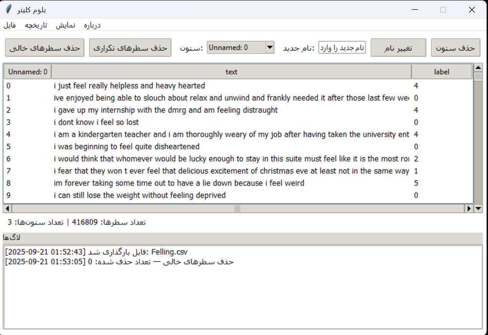
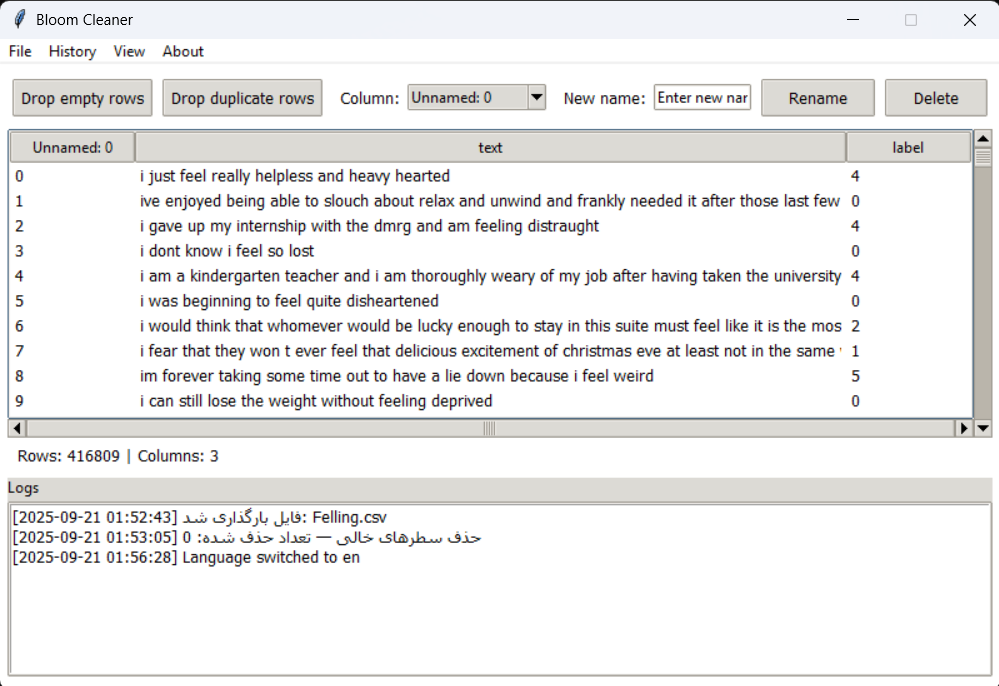

# Bloom Cleaner 🧹✨

<div align="center">

**A Professional GUI for Rapid, Transparent, and Reproducible Data Cleaning.**


</div>

---

## The Genesis of Bloom Cleaner

This project wasn't born from a feature list, but from a recurring frustration. As a data analyst, I found myself trapped in a loop. Every new project started with the same ritual: copy-pasting the familiar lines of `df.dropna()`, `df.drop_duplicates()`, and `df.rename()`.

This process was not just repetitive; it was opaque. I was executing commands blindly, constantly asking myself:
* "How many empty rows were *actually* deleted?"
* "Did my column rename succeed, or did I have a typo?"
* "What were the exact steps I took, and in what order?"

This lack of clarity and control felt inefficient and unprofessional. To solve my own problem, I developed Bloom Cleaner.

## The Guiding Philosophy

This frustration led to a core belief that defines this tool:

> **"Data cleaning is not just about removing empty rows."**

It's about building a foundation of **trust** in your data. It's the disciplined process of ensuring data integrity. This requires three things that standard scripting often lacks:

1.  **Absolute Transparency:** Knowing the exact impact of every action.
2.  **Total Control:** The ability to undo mistakes and steer the process with confidence.
3.  **Reproducibility:** A clear record of every transformation applied to the dataset.

Bloom Cleaner was engineered to deliver on these three principles through an intuitive graphical interface.

---

## Application Interface

The entire UI is fully bilingual and can be switched between Persian (فارسی) and English on the fly.

<table align="center" border="0">
  <tr style="border: none;">
    <td align="center" style="border: none;">
      <b>Persian Interface (رابط کاربری فارسی)</b>
      <br>
      
      <br>
    </td>
    <td align="center" style="border: none;">
      <b>English Interface</b>
      <br>
      
      <br>
    </td>
  </tr>
</table>

---

## Feature Matrix: A Detailed Breakdown

Bloom Cleaner integrates a powerful set of features into a seamless workflow.

### Core Data Engine
* **Backend Power:** Leverages the industry-standard **Pandas** library for high-performance and reliable data manipulation.
* **Versatile File Handling:** Natively supports importing and exporting both **CSV** (`.csv`) and **Excel** (`.xlsx`, `.xls`) files.
* **Optimized CSV Export:** Uses `utf-8-sig` encoding on save to ensure maximum compatibility and prevent character encoding issues with Excel.

### Cleaning & Transformation Operations
* **One-Click Null Removal:** Instantly drop all rows with any missing data (`dropna`).
* **One-Click Duplicate Removal:** Purge all duplicate rows from the dataset (`drop_duplicates`).
* **Interactive Column Renaming:** Select any column from an auto-populated dropdown and assign a new name.
* **Safe Column Deletion:** Securely delete any unwanted column from the dataset.

### Interface & User Experience (UX)
* **Live Data Table:** An interactive `ttk.Treeview` table previews the head of your dataset (intelligently limited to 1000 rows for performance) with both vertical and horizontal scrollbars.
* **Real-time Status Bar:** Get immediate feedback on the shape of your data with a status bar showing the current row and column counts.
* **Bilingual on the Fly:** Instantly switch the entire UI language from the "View" menu without restarting.
* **Smart Font Selection:** Intelligently detects and applies modern Persian fonts (`Vazirmatn`, `Vazir`) for a superior UI experience, with a graceful fallback to system defaults.
* **Polished UI Details:** Includes user-friendly details like placeholder text in entry boxes that clears on focus.

### History, Logging & Reproducibility
* **Multi-Level Undo/Redo:** A robust history system tracks up to **20 of your most recent actions**, allowing for full undo (`Ctrl+Z`) and redo (`Ctrl+Y`) capabilities.
* **Timestamped Action Logging:** Every operation is timestamped and recorded in a clear, readable log panel, creating a transparent audit trail.
* **Exportable Logs:** Save the entire session log to a `.txt` file for documentation or process verification.

### Keyboard Shortcuts
| Shortcut      | Action      |
| :------------ | :---------- |
| `Ctrl + O`    | Open File   |
| `Ctrl + S`    | Save File   |
| `Ctrl + Z`    | Undo Action |
| `Ctrl + Y`    | Redo Action |

---

## 🚀 Getting Started (For End-Users)

No installation required.
1.  Navigate to the **[Releases](https://github.com/Data-Blooom/Bloom-Cleaner/releases)** page.
2.  Download the latest `Bloom.Cleaner.exe` file.
3.  Run the application and start cleaning your data with confidence.

---

## 💻 How to Run (For Developers)

1.  **Clone the repository:**
    ```bash
    git clone [https://github.com/Data-Blooom/Bloom-Cleaner](https://github.com/Data-Blooom/Bloom-Cleaner)
    cd Bloom-Cleaner
    ```
2.  **Install dependencies:**
    ```bash
    pip install pandas openpyxl
    ```
3.  **Run the application:**
    ```bash
    python "Bloom Cleaner.py"
    ```

---

## 🤝 Contributing

Contributions, issues, and feature requests are welcome! Please feel free to check the **[issues page](https://github.com/Data-Blooom/Bloom-Cleaner/issues)** to see if you can help.

---

## ✒️ Author

* **Author:** Data Bloom
* **LinkTree:** [linktr.ee/Data_Bloom](https://linktr.ee/Data_Bloom)
